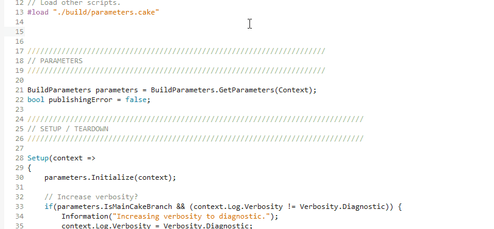

# Cake for Xamarin Studio

Adds support for the [Cake](http://cakebuild.net/) build tool in Xamarin Studio 6+. Includes support for syntax highlighting, new item and project templates and commands for bootstrapping important Cake files.

## Build scripts
The Cake script editor automatically triggers when it finds a `.cake` file.

 

## Template Installers

You can quickly add the default bootstrapper scripts or a Cake configuration file from either the *Project* menu or the context menu for any project in the Solution Pad.

## Templates

The extension includes new project templates for Cake modules, addins, and unit tests.

In addition, there is a file template for a new build script as well as samples for working with Cake modules.

## Snippets / Code Templates

Inside Cake scripts, you can use the `arg` and `task` snippets to quickly create `Argument`s and `Task`s respectively.

When authoring addins, you can also use the `alias` and `aliasp` snippets to quickly create method and property aliases, respectively.

## Contribute
Check out the [Cake contribution guidelines](http://cakebuild.net/docs/contributing/guidelines) if you want to contribute to this project.

For cloning and building this project yourself, make sure to install the Addin Maker addin for Xamarin Studio which enables some features used by this project.

## License
[MIT Licence](LICENSE) 
